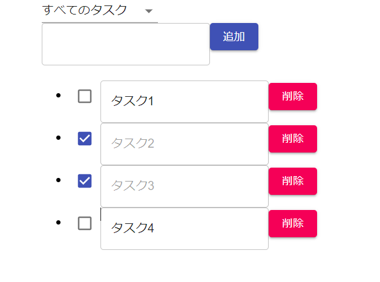

# 本アプリの概要

Reactで動作する簡易的なToDoアプリケーションです。

## Available Scripts

In the project directory, you can run:

### `yarn start`

Runs the app in the development mode.\
Open [http://localhost:3000](http://localhost:3000) to view it in the browser.

## 使用技術

- React
- Material-UI

## 参考URL

[React Hooks と TypeScript で簡単 TODO アプリ](https://zenn.dev/sprout2000/articles/60cc8f1aa08b4b)

[React入門 ～Material UI編～](https://zenn.dev/h_yoshikawa0724/articles/2020-09-24-react-material-ui)

